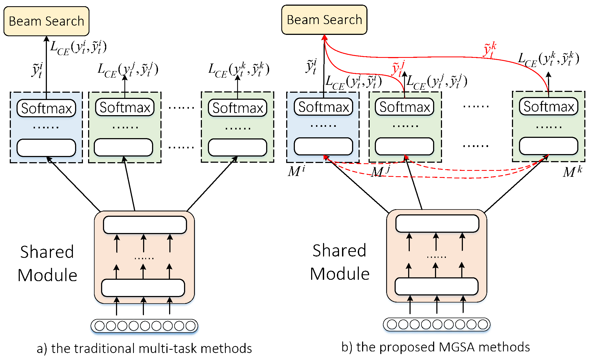

# The implementation of multi-granularity las model.
Based on ESPnet: end-to-end speech processing toolkit (v0.7.0)

The proposed MGSA approach for end-to-end ASR, where the alignment mapping information is applied for use in both architecture construction (the red dashed line) and output re-scoring (the solid red line)
<div align="left"></div>

## 1.Installation
- The Requirement:
    ```sh
    1) get your kaldi installed in KALDI_PATH
    2) cuda 9.0, cudnn >= 6.0
    3) GCC_VERSION >= 5.4.0

    ```
- Install Process:
    ```sh
    cd tools
    GCC_VERSION = 5.4.0
    KALDI_PATH=/home/$USER/espnet-dir/kaldi
    ln -s $KALDI_PATH kaldi

    # step1: install cupy[5.4],matplotlib[] (>= 5.0.0)
    pip install cupy || exit 1
    pip install matplotlib || exit 1

    # step2: install pytorch (>= 1.0.0)
    pip install torch==1.0.0 || exit 1

    # step3: install espnet
    pip install -e .. || exit 1

    # step4: install warp-ctc (requirement: pytorch ==1.0.0, gcc >=4.9.0)
    rm -rf warp-ctc
    git clone https://github.com/jnishi/warp-ctc.git
    python -c 'import torch as t;assert t.__version__[0] == "1"' &> /dev/null || { echo "[Error] pytorch version don't match 1.x.x!"; exit 1; }
    python -c "from distutils.version import LooseVersion as V;assert V('$GCC_VERSION') >= V('4.9')" &> /dev/null || { echo "[Error] Requires gcc>=4.9"; exit 1; }
    cd warp-ctc && git checkout -b pytorch-1.0.0 remotes/origin/pytorch-1.0.0 && cd .. || exit 1
    cd warp-ctc && mkdir -p build && cd build && cmake .. && make -j 10 && cd ../.. || exit 1
    pip install cffi || exit 1
    cd warp-ctc/pytorch_binding && python setup.py install && cd ../.. || exit 1

    # step5: install sentencepiece
    git clone https://github.com/google/sentencepiece.git || exit 1
    cd sentencepiece && mkdir -p build && cd build && (cmake3 .. || cmake ..) && make && cd ../.. || exit 1

    # step6: check installation
    python check_install.py
    ```

- Prepare the egs (e.g., Switchboard-300hrs)
     ```sh
    cd egs/swbd/asr1
    rm -rf steps
    rm -rf utils
    ln -s $KALDI_PATH/egs/wsj/s5/steps .
    ln -s $KALDI_PATH/egs/wsj/s5/utils .
    ```
   
## Run experiments on Switchboard-300hrs
- 1. Data preparation 
    ```sh
    cd egs/swbd/asr1/
    # download switchboard and assign $swbd1_dir, $eval2000_dir, $rt03_dir in scripts_mltask_linetuningsnbeta.sh
    swbd1_dir=/home/jtang/data/SWBD/LDC97S62
    eval2000_dir="/home/jtang/data/SWBD/LDC2002S09/hub5e_00 /home/jtang/data/SWBD/LDC2002T43"
    rt03_dir=/home/jtang/data/SWBD/LDC2007S10 
    sh scripts_mltask_linetuningsnbeta.sh --stage 0
    ```

## Citations
```
@article{tang2021multi,
  title={Multi-Granularity Sequence Alignment Mapping for Encoder-Decoder Based End-to-end ASR},
  author={Tang, Jian and Zhang, Jie and Song, Yan and Mcloughlin, Ian and Dai, Li-Rong},
  journal={IEEE/ACM Transactions on Audio, Speech, and Language Processing},
  year={2021},
  publisher={IEEE}
}
```
